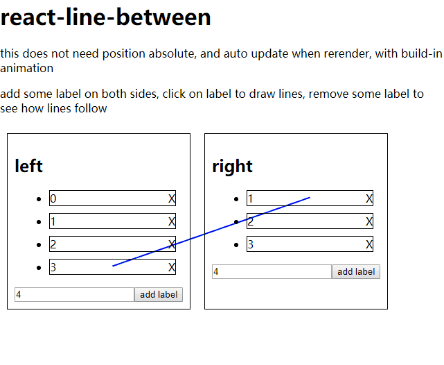

# react-line-between

this does not need position absolute, and auto update when rerender, with build-in animation | 无需绝对位置，自动重绘，自带动画


https://www.youtube.com/watch?v=H6yLY-E3fjE&list=PLM1v95K5B1ntVsYvNJIxgRPppngrO_X4s

## usage | 使用

1. install | 安装

```
yarn add react-line-between
// or npm
npm i react-line-between --save
```

2. add snapsvg | 添加snapsvg

```
<script src="https://cdn.jsdelivr.net/npm/snapsvg@0.5.1/dist/snap.svg.min.js"></script>
```

3. component code | 编写组件

```
import Container from 'react-line-between'
import { Component } from 'react'

class TestComponent extends Component {
  render() {
    return (<span >[line to]</span>)
  }
}

export default class Index extends Component {
  state = {
    lines: [],
    lis: [],
    input: '',
  }
  componentDidMount() {
    const { a, b } = this
    this.setState({
      lines: [
        {
          from: a,
          to: b,
          attrs: {
            fill: "#fc0",
            stroke: "#000",
            strokeWidth: 2,
          }
        },
      ],
    })
  }
  render() {
    const { lis, input } = this.state
    return (<Container ref={svg => this.svg = svg} lines={this.state.lines} updateOnRender={false}>
      <div>
        <span ref={a => this.a = a}>[line from]</span>
        <ul>{lis.map((x, i) => {
          return (<li key={i}>{x}</li>)
        })}</ul>
        <input value={this.state.input} onChange={(e) => this.setState({
          input: e.target.value,
        })} /><button onClick={() => this.setState({
          lis: lis.concat(input),
          input: '',
        })}>add li</button>
        <br />
        <button onClick={() => this.svg.updateSvg()}>redraw line</button>
        <TestComponent ref={b => this.b = b} />
      </div>
    </Container>)
  }
}

```

## apis

`props.lines` is an array of objects, each object should contain `from`- node or element to line from, `to`- node or element to line to, `attrs`- attributes for the svg Line

`props.lines` 是个列表, 每个元素都包含 `from`- 线开始的元素或组件, `to`- 线结束的元素或组件, `attrs`- svg Line的属性


```
<Container lines={[
  {
    from: a,
    to: b,
    attrs: {
      fill: "#fc0",
      stroke: "#000",
      strokeWidth: 2,
    }
  },
]} >
```

`props.updateOnRender` auto update line position when it rerenders, default `true`, you can turn it off and use a ref to call it's `updateSvg()` when you need

`props.updateOnRender` 当组件重绘的时候自动更新线的位置, 默认值 `true`, 你可以关闭自动更新并仅在你需要更新的时候通过ref调用`updateSvg()`

```
<Container ref={svg => this.svg = svg} updateOnRender={false} >
  ...
  <button onClick={() => this.svg.updateSvg()}>redraw line</button>
  ...
```

`props.animate` config how to animate when line updates, default `{duration = 600, easing = mina.linear }`, you can just use `false` to skip animation

`props.animate` 配置线更新的时候如何动画, 默认配置 `{duration = 600, easing = mina.linear }`, 你可以使用 `false` 来跳过动画

```
<Container animate={false} >
```

`props.Snap` and `props.mina` I use snapsvg as an injection rather than dependency because snapsvg does not support ssr, it uses window object in it's code. If you need to prevent global namespace pollution, you can use prop to specify them, if not specified `react-line-between` will look into window for them

`props.Snap` 和 `props.mina` 我这里仅使用注入的方式，而没有使用依赖的方式使用snapsvg因为它不支持SSR，它的代码中包含了window. 如果你需要避免全局命名空间污染, 你可以通过props来指定它们, 如果不指定的话 `react-line-between` 去 window 中找


```
//require or import
import Snap from 'snapsvg-cjs'
import Container from 'react-line-between'


//as prop when render
<Container Snap={Snap}>
  //things to render
</Container>
```

## try it out | 自己试试

```
git clone https://github.com/postor/react-line-between.git
cd example
yarn
yarn dev

# open http://localhost:3000
```
